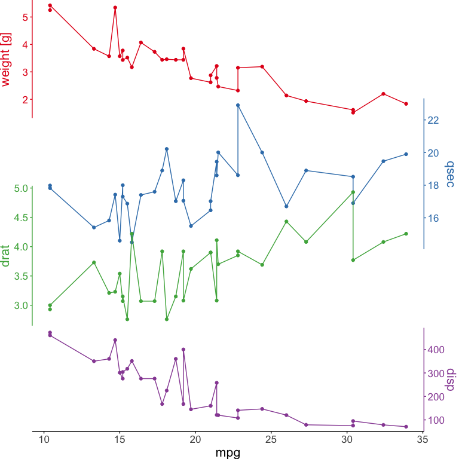
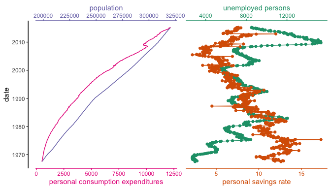

<!-- README.md is generated from README.Rmd. Please edit that file -->

# ggstackplot

<!-- badges: start -->

[](https://github.com/KopfLab/ggstackplot/actions/workflows/R-CMD-check.yaml)
[](https://ggstackplot.kopflab.org/)
[](https://app.codecov.io/gh/kopflab/ggstackplot)
<!-- badges: end -->

## About

Have you ever wanted to compare multiple panels of line plots that do
not share coordinate schemes? These kinds of plots are ubiquitous in the
Earth sciences, but there is not an easy way to create them with ggplot
facets.

## Installation

You can install ggstackplot from [GitHub](https://github.com/) with:

``` r
if(!requireNamespace("devtools", quietly = TRUE)) install.packages("devtools")
devtools::install_github("KopfLab/ggstackplot")
```

## Show me some code

``` r
library(ggstackplot)

# using the built-in economics dataset in ggplot2
ggplot2::economics |>
  ggstackplot(
    # define shared x axis
    x = date, 
    # define stacked y axes
    y = c(pce, pop, psavert, unemploy),
    # add a color palette
    palette = "Set1"
  )
```



## Show me more

``` r
library(ggplot2)

# creating a horizontal stack instead of vertical and using some of the many
# customization features available in ggstackplot
ggplot2::economics |>
  ggstackplot(
    # define shared y axis
    y = date, 
    # define the stacked x axes with custom axis labels
    x = c(
      "personal consumption expenditures" = pce, 
      "population" = pop, 
      "personal savings rate" = psavert, 
      "unemployed persons" = unemploy),
    # add a different color palette
    palette = "Dark2",
    # overlay the pce & pop plots and psavert & unemploy plots
    overlap = c(1, 0, 1),
    # provide a custom plot template
    template = 
      ggplot() +
      geom_path() +
      theme_stackplot() +
      scale_y_date(),
    # add plot specific elements
    add = 
      list(
        # add points just for 2 plots
        `unemployed persons` = geom_point(),
        `personal savings rate` = geom_point()
      )
  )
```



## Next steps

- check out the
  **[Features](https://ggstackplot.kopflab.org/articles/features.html)**
  vignette for details on all available functionality
- check out the
  **[Examples](https://ggstackplot.kopflab.org/articles/examples.html)**
  vignette for scientific data examples
